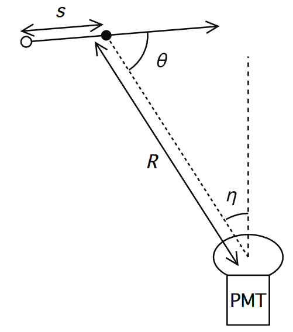

# fiTQun: 
employs a maximum likelihood method using the charge and time information that is observed by the PMTs to reconstruct particle types and kinematics in the detector.

$$
L(\mathbf{x})=\prod_j^{\text {unhit }} P_j(\text { unhit } \mid \mathbf{x}) \prod_i^{\text {hit }}\left\{1-P_i(\text { unhit } \mid \mathbf{x})\right\} f_q\left(q_i \mid \mathbf{x}\right) f_t\left(t_i \mid \mathbf{x}\right)
$$

# Predicted Charge from Direct Light
$$
\mu^{\mathrm{dir}}=\Phi(p) \int d s g(p, s, \cos \theta) \Omega(R) T(R) \epsilon(\eta)
$$

    

## Cherenkov Emission Profile
The Cherenkov emission profile $g(p; s; \cos\theta)$ 描述了粒子动量为p时，单位径迹长度，单位立体角发射的光子数
产生方法：
1. 探测器中均匀放置一定动量的电子
2. 统计每个PMT上收集到的光子数，以及与电子位置的相对位置、径迹长度等
   
考虑到主要的几种本底的衰变：
| $\underline{R a d i o a c t i v e}$ isotope | $\tau(\mathrm{s})$ | Decay mode | $E_{\text {kin }} \cdot(\mathrm{MeV})$ | Primary process |
| :---: | :---: | :---: | :---: | :---: |
| ${ }^{11} \mathrm{Be}$ | 19.9 | $\beta^{-}$ | 11.51 | ${ }^{16} \mathrm{O}(n, \alpha+2 p){ }^{11} \mathrm{Be}$ |
|  |  | $\beta^{-} \gamma$ | $9.41+2.1(\gamma)$ |  |
| ${ }^{16} \mathrm{~N}$ | 10.3 | $\beta^{-}$ | 10.44 | ${ }^{16} \mathrm{O}(n, p){ }^{16} \mathrm{~N}$ |
|  |  | $\beta^{-} \gamma$ | $4.27+6.13(\gamma)$ |  |
| ${ }^{15} \mathrm{C}$ | 3.53 | $\beta^{-}$ | 9.77 | ${ }^{16} \mathrm{O}(n, 2 p)^{15} \mathrm{C}$ |
|  |  | $\beta^{-} \gamma$ | $4.51+5.30(\gamma)$ |  |
| ${ }^8 \mathrm{Li}$ | 1.21 | $\beta^{-}$ | $\sim 13.0$ | ${ }^{16} \mathrm{O}\left(\pi^{-}, \alpha+{ }^2 \mathrm{H}+p+n\right)^8 \mathrm{Li}$ |
| ${ }^8 \mathrm{~B}$ | 1.11 | $\beta^{+}$ | $\sim 13.9$ | ${ }^{16} \mathrm{O}\left(\pi^{+}, \alpha+2 p+2 n\right)^8 \mathrm{~B}$ |
| ${ }^{16} \mathrm{C}$ | 1.08 | $\beta^{-}+n$ | $\sim 4$ | ${ }^{18} \mathrm{O}\left(\pi^{-}, n+p\right)^{16} \mathrm{C}$ |
| ${ }^9 \mathrm{Li}$ | 0.26 | $\beta^{-}$ | 13.6 | ${ }^{16} \mathrm{O}\left(\pi^{-}, \alpha+2 p+n\right)^9 \mathrm{Li}$ |
|  |  | $\beta^{-}+n$ | $\sim 10$ |  |
| ${ }^9 \mathrm{C}$ | 0.18 | $\beta^{+}+p$ | $3-15$ | ${ }^{16} \mathrm{O}(n, \alpha+4 n)^9 \mathrm{C}$ |
| ${ }^8 \mathrm{He}$ | 0.17 | $\beta^{-} \gamma$   $\beta^{-}+n$ | $9.67+0.98(\gamma)$ | ${ }^{16} \mathrm{O}\left(\pi^{-},{ }^3 \mathrm{H}+4 p+n\right)^8 \mathrm{He}$ |
| ${ }^{12} \mathrm{Be}$ | 0.034 | $\beta^{-}$ | 11.71 | ${ }^{18} \mathrm{O}\left(\pi^{-}, \alpha+p+n\right)^{12} \mathrm{Be}$ |
| ${ }^{12} \mathrm{~B}$ | 0.029 | $\beta^{-}$ | 13.37 | ${ }^{16} \mathrm{O}(n, \alpha+p){ }^{12} \mathrm{~B}$ |
| ${ }^{13} \mathrm{~B}$ | 0.025 | $\beta^{-}$ | 13.44 | ${ }^{16} \mathrm{O}\left(\pi^{-}, 2 p+n\right)^{13} \mathrm{~B}$ |
| ${ }^{14} \mathrm{~B}$ | 0.02 | $\beta^{-} \gamma$ | $14.55+6.09(\gamma)$ | ${ }^{16} \mathrm{O}(n, 3 p)^{14} \mathrm{~B}$ |
| ${ }^{12} \mathrm{~N}$ | 0.016 | $\beta^{+}$ | 16.38 | ${ }^{16} \mathrm{O}\left(\pi^{+}, 2 p+2 n\right)^{12} \mathrm{~N}$ |
| ${ }^{13} \mathrm{O}$ | 0.013 | $\beta^{+}+p$ | $8-14$ | ${ }^{16} \mathrm{O}\left(\mu^{-}, \mu^{-}+p+2 n+\pi^{-}\right){ }^{13} \mathrm{O}$ |
| ${ }^{11} \mathrm{Li}$ | 0.012 | $\beta^{-}$ | 20.62 | ${ }^{16} \mathrm{O}\left(\pi^{+}, 5 p+\pi^0+\pi^{+}\right){ }^{11} \mathrm{Li}$ |
|  |  | $\beta^{-}+n$ | $\sim 16$ |  |

能量基本在25MeV以下，因此在模拟时，选择将电子的动量放置为1-20MeV，以及30，40，50MeV，每个动量10w个点，在探测器CD中均匀放置。
